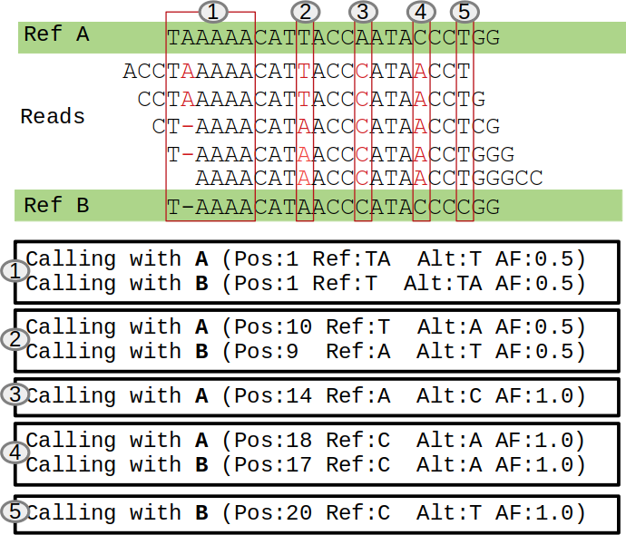

**********
How to use
**********

PHASEfilter package offers five main tools to the user.

phasefilter
+++++++++++

With this tool it is possible to indentify heterozygous and loss of heterozygoty between two diploid references. It is also possible to set a threshold of heterozygous/homozygous variant base on Allele Deep (AD). A threshold to remove variants with low Allele frequency is also available.

To classify variants it is always necessary to pass two VCF files, one for each reference phase. After that, the *phasefilter* will go through the variants called in *reference A* (ref1) and check if there are any homologous in the variants called in *reference B* (ref2). For each variant called in the *reference A* it can happen three situations:

-  both references, for the position in analysis, are equal and the variant is valid (situation 4 previous)
-  position is heterozygous in the reference and the variant reflects it, so the variant is removed (situation 1 and 2);
-  position is heterozygous in the references and the variant is homozygous, so the variant is valid but is also going to “loss of heterozygosity” (LOH) output (situation 3).
-  position is heterozygous in the references and there is no variant, because the VCF in analysis is the one called with reference A (ref1) (situation 5).

Most common use of the phasefilter:

.. code-block:: shell
   :linenos:

   $ phasefilter --help
   
   ### can copy some example data
   $ copy_raw_data_example_phasefilter --out temp_raw_data
   
   ### run PHASEfilter
   $ phasefilter --ref1 temp_raw_data/Ca22chr7A_C_albicans_SC5314.fasta --ref2 temp_raw_data/Ca22chr7B_C_albicans_SC5314.fasta \ 
   --vcf1 temp_raw_data/T1_Fluc_7A_snps.vcf.gz --vcf2 temp_raw_data/T1_Fluc_7B_snps.vcf.gz --out output_dir
   $ phasefilter --ref1 temp_raw_data/Ca22chr7A_C_albicans_SC5314.fasta --ref2 temp_raw_data/Ca22chr7B_C_albicans_SC5314.fasta \ 
   --vcf1 temp_raw_data/T1_Fluc_7A_snps.vcf.gz --vcf2 temp_raw_data/T1_Fluc_7B_snps.vcf.gz --out output_dir
   
   ### run PHASEfilter with chain, if available
   $ phasefilter --ref1 temp_raw_data/Ca22chr7A_C_albicans_SC5314.fasta --ref2 temp_raw_data/Ca22chr7B_C_albicans_SC5314.fasta \ 
   --vcf1 temp_raw_data/T1_Fluc_7A_snps.vcf.gz --vcf2 temp_raw_data/T1_Fluc_7B_snps.vcf.gz --out output_dir \
   --chain_A_B temp_raw_data/Assembly22_hapA_To_Assembly22_hapB.over.chain \
   --chain_B_A temp_raw_data/Assembly22_hapB_To_Assembly22_hapA.over.chain
   
   
In the previous case there are four parameteres:

-  ref1 - has the fasta reference of the first form of species in analysis;
-  ref2 - has the fasta reference of the second form of species in analysis. It is the hit;
-  vcf1 - has he variants called from the ref1;
-  vcf2 - has he variants called from the ref2. It is the hit;
-  out - directory where the files will be saved;

You can use a chain if exists:

-  chain_A_B - chain from haplotype A to haplotype B;
-  chain_B_A - chain from haplotype B to haplotype A;

.. important::
   By default, heterozygous and homozygous form are defined by AC info for each variant. If AC = 1 is heterozygous, > 1 is homozygous. GATK adds this info tags at each variant,
   Loss Of Heterozygous (LOH) is only detected if the VCF file has the AC info tag for each variant.
   
Eight possible files will be created after the commands ends. The outputs are from refrence A (ref1) to reference B (ref2), and from reference B (ref2) to reference A (ref1).

-  report_[A]_to_[B].txt - has the statistics about the analysis;
-  valid_[A]_to_[B].vcf.gz - has all variants that are not heterozygous between two references;
-  removed_[A]_to_[B].vcf.gz - has all heterozygous variants;
-  LOH_[A]_to_[B].vcf.gz - has all variants that are loss of heterozygous between two references. This variants are also in 'valid_[A]_to_[B].vcf.gz' file.

-  report_[B]_to_[A].txt - has the statistics about the analysis from ;
-  valid_[B]_to_[A].vcf.gz - has all variants that are not heterozygous between two references;
-  removed_[B]_to_[A].vcf.gz - has all heterozygous variants;
-  LOH_[B]_to_[A].vcf.gz - has all variants that are loss of heterozygous between two references. This variants are also in 'valid_[B]_to_[A].vcf.gz' file.

Headings description in report files:

-  **Heterozygous (Removed)**  Heterozygous identified and they go the re remove_[YYY]_to[XXX].vcf.gz file
-  **Keep alleles**   Alleles present in valid_[YYY]_to[XXX].vcf.gz file
-  **LOH alleles Loss of Heterozygous** They are in valid_[YYY]_to[XXX].vcf.gz and LOH_[YYY]_to[XXX].vcf.gz file.
-  **Other than SNP** Other variants thar are not SNPs and INDELs and they go to valid_[YYY]_to[XXX].vcf.gz file
-  **Don't have hit position** Variants that don’t have position in hit (ref B) genome and they go to valid_[YYY]_to[XXX].vcf.gz file
-  **Could Not Fetch VCF Record on Hit**   Variants that are present in source file but not in hit VCF file. They go to valid_[YYY]_to[XXX].vcf.gz file
-  **Total alleles**  All the alleles present in the source vcf file. Analyzed alleles.
-  **Total Alleles new Source VCF**  Total alleles that are in valid_[YYY]_to[XXX].vcf.gz file
-  **Method**   Alignment method.
-  **Alignment %** Percentage of alignment.

If your VCF files has the allele deep (AD) format it is also possible to pass two extra parameters: 

-  threshold_heterozygous_AD - it is possible to define heterozygous/homozygous level define by Allele Deep counts, otherwise it is defined by Allele Count (AC);
-  remove_variants_by_AD_ratio - you can remove variants based on low Allele Frequency for each variant. The Allele Frequency it will be obtained by Allele Deep counts.
 
.. code-block:: shell
   :linenos:

   ## other possibility
   $ phasefilter --help
   $ phasefilter --ref1 C_albicans_SC5314_chrA_A22_chromosomes.fasta --ref2 C_albicans_SC5314_chrB_A22_chromosomes.fasta --vcf1 A-M_S4_chrA_filtered_snps.vcf.gz \
   --vcf2 A-M_S4_chrB_filtered_snps.vcf.gz --out output_dir \
   --threshold_heterozygous_AD 0.4 --remove_variants_by_AD_ratio 0.1
   
.. note::
   If you pass a value to remove variants with low Allele Frequency, this value will be calculated with the counts that are in Allele Count (AC) in vcf file.
   For these two last parameters the Allele Frequency it will be calculated with the ratio of AD format field from VCF. AD='<reads ref>,<reads alt1>, <reads alt2>, etc".
   The parameter 'threshold_heterozygous_AD' will replace Allele Frequency (AF) if defined. This is will be used to define if a variant is Homozygous or Heterozygous. 

.. important::
   The vcf file in analysis it is always the one in *ref1* parameters,

phasefilter_single
++++++++++++++++++

This tool do as the same of the previous script but only analysis from Reference A (ref1) to Reference B (ref2)

Most common use of the phasefilter:

.. code-block:: shell
   :linenos:

   $ phasefilter_single --help
   
   ### can copy some example data
   $ copy_raw_data_example_phasefilter --out temp_raw_data
   
   ### run PHASEfilter
   $ phasefilter_single --ref1 temp_raw_data/Ca22chr7A_C_albicans_SC5314.fasta --ref2 temp_raw_data/Ca22chr7B_C_albicans_SC5314.fasta \ 
   --vcf1 temp_raw_data/T1_Fluc_7A_snps.vcf.gz --vcf2 temp_raw_data/T1_Fluc_7B_snps.vcf.gz --out_vcf A-M_S4.vcf.gz
   
   ### run PHASEfilter with chain, if available
   $ phasefilter_single --ref1 temp_raw_data/Ca22chr7A_C_albicans_SC5314.fasta --ref2 temp_raw_data/Ca22chr7B_C_albicans_SC5314.fasta \ 
   --vcf1 temp_raw_data/T1_Fluc_7A_snps.vcf.gz --vcf2 temp_raw_data/T1_Fluc_7B_snps.vcf.gz --out_vcf A-M_S4.vcf.gz \
   --chain temp_raw_data/Assembly22_hapA_To_Assembly22_hapB.over.chain
   
In the previous case there are four parameteres:

-  ref1 - has the fasta reference of the first form of species in analysis;
-  ref2 - has the fasta reference of the second form of species in analysis. It is the hit;
-  vcf1 - has he variants called from the ref1;
-  vcf2 - has he variants called from the ref2. It is the hit;
-  out_vcf - has the file with with results: 1) passed variants; 2) heterozygous; 3) LOH variants;

You can use a chain if exists:

-  chain - chain from haplotype A to haplotype B, in previous example;

Four possible files will be created after the commands ends: 

-  report_<out_file>.txt - has the statistics about the analysis;
-  valid_<out_file>.vcf.gz - has all variants that are not heterozygous between two references;
-  removed_<out_file>.vcf.gz - has all heterozygous variants;
-  LOH_<out_file>.vcf.gz - has all variants that are loss of heterozygous between two references. This variants are also in 'out_file.vcf.gz' file.

If your VCF files has the allele deep (AD) format it is also possible to pass two extra parameters: 

-  threshold_heterozygous_AD - it is possible to define heterozygous/homozygous level define by Allele Deep counts, otherwise it is defined by Allele Count (AC);
-  remove_variants_by_AD_ratio - you can remove variants based on low Allele Frequency for each variant. The Allele Frequency it will be obtained by Allele Deep counts.

.. note::
   For these two last parameters the Allele Frequency it will be calculated with the ratio of AD format field from VCF. AD='<reads ref>,<reads alt1>, <reads alt2>, etc".
   The parameter 'threshold_heterozygous_AD' will replace Allele Frequency (AF) if defined. This is will be used to define if a variant is Homozygous or Heterozygous. 

make_alignment
++++++++++++++

Align two fasta files and creates a report with the alignment percentage. This tool also creates a ClustalX alignment file that is produced with the results of minimpa2 aligner. It accpets three mandatory parameters as two optinal parameters.
Most common use of the make_alignment:

.. code-block:: shell
   :linenos:

   $ make_alignment --help
   $ copy_raw_data_example_phasefilter --out temp_raw_data
   $ make_alignment --ref1 temp_raw_data/Ca22chr7A_C_albicans_SC5314.fasta --ref2 temp_raw_data/Ca22chr7B_C_albicans_SC5314.fasta --out report.txt

   
In the previous case there are four parameteres:

-  ref1 - has the fasta reference of the first form of species in analysis;
-  ref2 - has the fasta reference of the second form of species in analysis. It is the hit;
-  out  - name for the report;

This tool has three extra parameters: 

-  pass_chr - name or names of chromossomes to pass. Can be more than one separated by comma. It is the prefix of the chromossome that is necessary to pass;
-  out_alignment - folder name where an alignment will be save. It has ClustalX format;
-  out_new_reference - create a new reference with degenerated bases on heterozygous positions.

.. code-block:: shell
   :linenos:

   $ make_alignment --help
   $ make_alignment --ref1 C_albicans_SC5314_chrA_A22_chromosomes.fasta --ref2 C_albicans_SC5314_chrB_A22_chromosomes.fasta --out report.txt \
   --pass_chr chrI,chrII --out_alignment path_alignment
   $ make_alignment --ref1 C_albicans_SC5314_chrA_A22_chromosomes.fasta --ref2 C_albicans_SC5314_chrB_A22_chromosomes.fasta --out report.txt \
   --pass_chr chrI,chrII --out_alignment path_alignment --out_new_reference path_new_reference
   $ make_alignment --ref1 C_albicans_SC5314_chrA_A22_chromosomes.fasta --ref2 C_albicans_SC5314_chrB_A22_chromosomes.fasta --out report.txt \
   --out_new_reference path_new_reference
   $ make_alignment --ref1 C_albicans_SC5314_chrA_A22_chromosomes.fasta --ref2 C_albicans_SC5314_chrB_A22_chromosomes.fasta --out report.txt \
   --out_new_reference path_new_reference --threading 4

.. note::
   Save the alignements take long time.

reference_statistics
++++++++++++++++++++

Creates a report based on the number of bases that exists in the chromosomes present in fasta file.
Most common use of the reference_statistics:

.. code-block:: shell
   :linenos:

   $ reference_statistics --help
   $ copy_raw_data_example_phasefilter --out temp_raw_data
   $ reference_statistics --ref temp_raw_data/Ca22chr7A_C_albicans_SC5314.fasta --out report_stats.txt
   
In the previous case there are four parameteres:

-  ref - fasta file has sequences;
-  out - report name where will be saved the statistics;
 
synchronize_genomes
+++++++++++++++++++

Synchronize two references and add two new fields (StartHit;EndHit) to GFF files with the positions of the second reference, the hit reference (ref2). For VCF files only adds (start_hit) to Info notations. It accepts 4 mandatory parameters and one optional. It is necessary to pass a VCF or a GFF file.
Most common use of the synchronize_genomes:

.. code-block:: shell
   :linenos:

   $ synchronize_genomes --help
   $ copy_raw_data_example_phasefilter --out temp_raw_data
   $ synchronize_genomes --ref1 temp_raw_data/Ca22chr7A_C_albicans_SC5314.fasta --ref2 temp_raw_data/Ca22chr7B_C_albicans_SC5314.fasta \
   --gff temp_raw_data/T1_Fluc_7A_snps.gff3 --out T1_Fluc_7A_snps.sync.gff3
   OR
   $ synchronize_genomes --ref1 temp_raw_data/Ca22chr7A_C_albicans_SC5314.fasta --ref2 temp_raw_data/Ca22chr7B_C_albicans_SC5314.fasta \
   --vcf temp_raw_data/T1_Fluc_7A_snps.vcf.gz --out T1_Fluc_7A_snps.sync.vcf
   
   ## with chain
   $ synchronize_genomes --ref1 temp_raw_data/Ca22chr7A_C_albicans_SC5314.fasta --ref2 temp_raw_data/Ca22chr7B_C_albicans_SC5314.fasta \
   --gff temp_raw_data/T1_Fluc_7A_snps.gff3 --out T1_Fluc_7A_snps.sync.gff3 --chain temp_raw_data/Assembly22_hapA_To_Assembly22_hapB.over.chain
   OR
   $ synchronize_genomes --ref1 temp_raw_data/Ca22chr7A_C_albicans_SC5314.fasta --ref2 temp_raw_data/Ca22chr7B_C_albicans_SC5314.fasta \
   --vcf temp_raw_data/T1_Fluc_7A_snps.vcf.gz --out T1_Fluc_7A_snps.sync.vcf --chain temp_raw_data/Assembly22_hapA_To_Assembly22_hapB.over.chain
   
In the previous case there are four parameteres:

-  ref1 - has the fasta reference of the first form of species in analysis;
-  ref2 - has the fasta reference of the second form of species in analysis. It is the hit;
-  gff  - has he variants called from the ref1;
-  out  - has the file with passed variants, not heterozygous;

Can also change the gff parameter to vcf:

-  vcf  - has he variants called from the ref1;

This tool has one extra parameter: 

-  pass_chr - name or names of chromossomes to pass. Can be more than one separated by comma. It is the prefix of the chromossome that is necessary to pass;

You can also pass a chain if exists:

- chain -  chain from haplotype A to haplotype B, in previous example;

.. code-block:: shell
   :linenos:

   $ synchronize_genomes --ref1 S288C_reference_chr_names_cleaned.fna --ref2 S01.assembly.final.fa --vcf S01.TE.vcf --out result.vcf --pass_chr chrmt
   $ synchronize_genomes --ref1 S288C_reference_chr_names_cleaned.fna --ref2 S01.assembly.final.fa --vcf S01.TE.vcf.gz --out result.vcf.gz --pass_chr chr_to_pass
   $ synchronize_genomes --ref1 S288C_reference_chr_names_cleaned.fna --ref2 S01.assembly.final.fa --vcf S01.TE.vcf.gz --out result.vcf
   
   ### with example data
   $ copy_raw_data_example_phasefilter --out temp_raw_data
   $ synchronize_genomes --ref1 temp_raw_data/Ca22chr7A_C_albicans_SC5314.fasta --ref2 temp_raw_data/Ca22chr7B_C_albicans_SC5314.fasta \
   --vcf temp_raw_data/T1_Fluc_7A_snps.vcf.gz --out result.vcf

